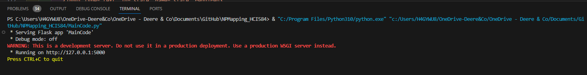
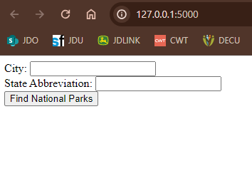
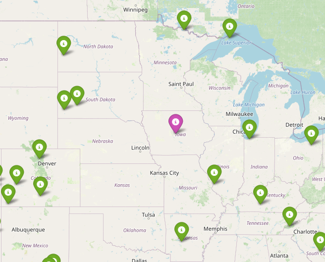
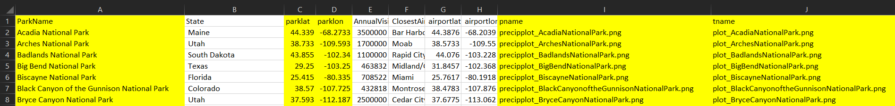

# NPMapping_HCI584
National Park Mapping for HCI584 Semester Project

Overview: 
This project takes the user location and calculates the distance to all the national parks in the US. It then maps those and brings up the closest parks. It also includes some weather data on each park and a link to the National Park Website to find out more information about those parks. 

To Use: 
Open Maincode.py 
click Run
In the terminal you will get a link to the app: 

Click on it to launch the webpage
You should see this page for you to enter your city and state: 

Once you enter your information press the find national parks button
You will then come to an interactive map where you can find more information about the National Parks you might want to visit!

ERRORS: If you do not enter a valid City & State combination, you will get an error message and need to press the back arrow to try again. 

Changing/Adding National Parks: 
If there are new national parks added that you do not see on the map, you can add these to get additional parks to show up!
1. Open npdata.csv
2. In the park tab add the Name of the national park, and in the parklat & parklon add the park coordinates
3. Under Pname & tname in the npdata.csv, follow the naming system to call up the plots you will create later

4. If you want to see the temp & precipitation data you would need to look up that information and add it to the precipdata.csv & tempdata.csv accordingly
5. Then run the maincode_plotting to get the updated graphs
    - You will need to take the spaces out of the graph names for the new one and add them to the static folder
6. Then run maincode.py as normal and the new plots and park should appear!

